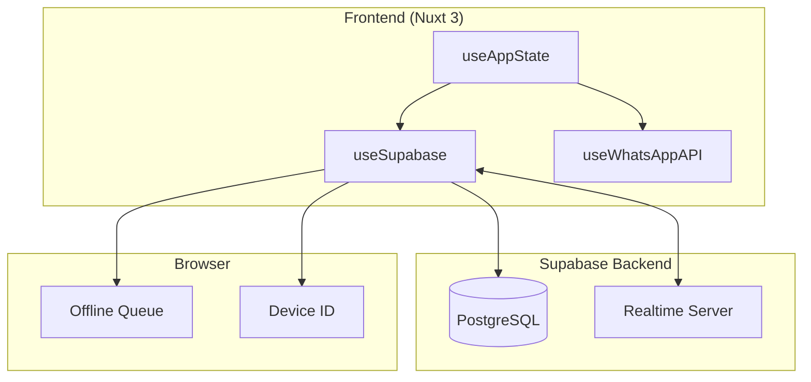

# Design Document: Supabase Realtime Integration

## Overview

Fitur ini mengintegrasikan Supabase Realtime ke dalam aplikasi Broadcasto untuk memungkinkan sinkronisasi data real-time antar device. Implementasi akan menggantikan localStorage dengan Supabase sebagai persistent storage, sambil mempertahankan local state untuk performa dan offline support.

### Goals
- Migrasi dari localStorage ke Supabase untuk broadcast history dan scheduled messages
- Real-time sync antar device menggunakan Supabase Realtime subscriptions
- Offline support dengan queue mechanism
- Device session tracking untuk data isolation

### Non-Goals
- Migrasi contacts (tetap dari WhatsApp API)
- End-to-end encryption
- Multi-user collaboration (fokus pada single user, multi-device)

## Architecture



### Data Flow

1. **Write Operations**: Local state → Supabase → Realtime broadcast → Other devices
2. **Read Operations**: Supabase → Local state (on init) + Realtime updates
3. **Offline**: Local state → Offline queue → Supabase (when online)

## Components and Interfaces

### 1. useSupabase Composable

```typescript
interface UseSupabase {
  // Connection State
  isConnected: Readonly<Ref<boolean>>
  isSyncing: Readonly<Ref<boolean>>
  lastSyncAt: Readonly<Ref<Date | null>>
  
  // Device Session
  deviceId: Readonly<Ref<string>>
  initDeviceSession(): Promise<void>
  updateDeviceSession(whatsappNumber: string): Promise<void>
  deactivateDeviceSession(): Promise<void>
  
  // Broadcast History
  fetchBroadcastHistory(): Promise<BroadcastHistoryRecord[]>
  saveBroadcastHistory(broadcast: BroadcastHistory): Promise<void>
  deleteBroadcastHistory(id: string): Promise<void>
  
  // Scheduled Messages
  fetchScheduledMessages(): Promise<ScheduledMessageRecord[]>
  saveScheduledMessage(message: ScheduledMessage): Promise<void>
  updateScheduledMessageStatus(id: string, status: string): Promise<void>
  deleteScheduledMessage(id: string): Promise<void>
  
  // Realtime Subscriptions
  subscribeToChanges(): void
  unsubscribeFromChanges(): void
  
  // Offline Queue
  processOfflineQueue(): Promise<void>
  queueOperation(operation: QueuedOperation): void
}
```

### 2. Type Definitions

```typescript
// Database record types (match Supabase schema)
interface BroadcastHistoryRecord {
  id: string
  device_id: string
  message: string
  recipients: { phone: string; name?: string }[]
  sent_count: number
  failed_count: number
  status: 'pending' | 'in_progress' | 'completed' | 'failed'
  created_at: string
  updated_at: string
}

interface ScheduledMessageRecord {
  id: string
  contact_id: string | null
  broadcast_id: string | null
  message: string
  media_url: string | null
  media_type: string | null
  scheduled_time: string
  status: 'pending' | 'sent' | 'failed' | 'cancelled'
  error_message: string | null
  created_at: string
  sent_at: string | null
}

interface DeviceSessionRecord {
  id: string
  device_id: string
  whatsapp_number: string | null
  is_active: boolean
  last_active: string
  created_at: string
  updated_at: string
}

// Offline queue types
interface QueuedOperation {
  id: string
  type: 'insert' | 'update' | 'delete'
  table: 'broadcast_history' | 'scheduled_messages'
  data: Record<string, unknown>
  timestamp: number
}

// Realtime payload types
interface RealtimePayload<T> {
  eventType: 'INSERT' | 'UPDATE' | 'DELETE'
  new: T | null
  old: T | null
}
```

### 3. Supabase Client Configuration

```typescript
// plugins/supabase.client.ts
import { createClient } from '@supabase/supabase-js'

export default defineNuxtPlugin(() => {
  const config = useRuntimeConfig()
  
  const supabase = createClient(
    config.public.supabaseUrl,
    config.public.supabaseAnonKey,
    {
      realtime: {
        params: {
          eventsPerSecond: 10
        }
      }
    }
  )
  
  return {
    provide: {
      supabase
    }
  }
})
```

## Data Models

### Existing Supabase Tables (Already Created)

The following tables already exist in the Supabase project:

1. **device_sessions** - Device/browser session tracking
2. **broadcast_history** - Broadcast campaign records
3. **broadcast_details** - Per-recipient broadcast status
4. **scheduled_messages** - Scheduled message queue

### Local to Database Type Mapping

| Local Type (useAppState) | Database Table | Transformation |
|--------------------------|----------------|----------------|
| BroadcastHistory | broadcast_history | id, message, status mapping; recipients as JSONB |
| ScheduledMessage | scheduled_messages | scheduled_at → scheduled_time; recipient → contact lookup |

## Correctness Properties

*A property is a characteristic or behavior that should hold true across all valid executions of a system-essentially, a formal statement about what the system should do. Properties serve as the bridge between human-readable specifications and machine-verifiable correctness guarantees.*

Based on the prework analysis, the following properties have been identified:

### Property 1: Broadcast History Round-Trip Consistency
*For any* valid BroadcastHistory object, saving it to Supabase and then fetching it back should produce an equivalent object (with expected transformations applied).
**Validates: Requirements 1.1, 1.2, 5.5, 5.6**

### Property 2: Scheduled Message Round-Trip Consistency
*For any* valid ScheduledMessage object, saving it to Supabase and then fetching it back should produce an equivalent object.
**Validates: Requirements 2.1, 2.4, 5.5, 5.6**

### Property 3: Realtime INSERT Event Updates Local State
*For any* INSERT event received via Realtime subscription, the local state should contain the new record after processing.
**Validates: Requirements 1.3, 2.3, 3.2**

### Property 4: Realtime UPDATE Event Updates Local State
*For any* UPDATE event received via Realtime subscription, the corresponding record in local state should reflect the updated values.
**Validates: Requirements 1.3, 2.3, 3.3**

### Property 5: Realtime DELETE Event Removes From Local State
*For any* DELETE event received via Realtime subscription, the deleted record should no longer exist in local state.
**Validates: Requirements 3.4**

### Property 6: Device ID Filtering
*For any* fetch operation on broadcast_history, all returned records should have device_id matching the current device's ID.
**Validates: Requirements 4.3**

### Property 7: Offline Queue FIFO Processing
*For any* sequence of offline operations, when connection is restored, operations should be processed in the same order they were queued (FIFO).
**Validates: Requirements 6.2, 6.3**

### Property 8: Last-Write-Wins Conflict Resolution
*For any* conflicting updates (same record, different values), the update with the later updated_at timestamp should prevail.
**Validates: Requirements 6.4**

### Property 9: Scheduled Message Status Update
*For any* scheduled message cancellation, the status in database should be 'cancelled' after the operation completes.
**Validates: Requirements 2.2**

## Error Handling

### Connection Errors
- Supabase client handles automatic reconnection
- Application tracks connection state via `isConnected` ref
- Operations during disconnection are queued

### Operation Errors
```typescript
interface SupabaseError {
  code: string
  message: string
  details?: string
}

// Error handling in composable
const handleError = (error: SupabaseError, operation: string) => {
  console.error(`[Supabase] ${operation} failed:`, error)
  
  if (error.code === 'PGRST301') {
    // Row not found - may have been deleted
    return null
  }
  
  if (error.code === '23505') {
    // Unique constraint violation - handle duplicate
    return 'duplicate'
  }
  
  throw error
}
```

### Offline Queue Error Recovery
- Failed operations are retried with exponential backoff
- After max retries, operation is logged and removed from queue
- User is notified of persistent failures

## Testing Strategy

### Dual Testing Approach

This implementation uses both unit tests and property-based tests:

1. **Unit Tests**: Verify specific examples, edge cases, and integration points
2. **Property-Based Tests**: Verify universal properties across random inputs

### Property-Based Testing Library

We will use **fast-check** for property-based testing in TypeScript/JavaScript.

```bash
npm install --save-dev fast-check
```

### Test Structure

```typescript
// tests/composables/useSupabase.test.ts
import * as fc from 'fast-check'
import { describe, it, expect } from 'vitest'

describe('useSupabase', () => {
  // Unit tests for specific scenarios
  describe('unit tests', () => {
    it('should initialize device session on first load', async () => {
      // ...
    })
  })
  
  // Property-based tests
  describe('property tests', () => {
    it('Property 1: Broadcast History Round-Trip', () => {
      fc.assert(
        fc.property(
          broadcastHistoryArbitrary,
          async (broadcast) => {
            // Save and fetch back
            await saveBroadcastHistory(broadcast)
            const fetched = await fetchBroadcastHistory()
            const found = fetched.find(b => b.id === broadcast.id)
            
            // Verify equivalence
            expect(found?.message).toBe(broadcast.message)
            expect(found?.status).toBe(broadcast.status)
          }
        ),
        { numRuns: 100 }
      )
    })
  })
})
```

### Test Generators (Arbitraries)

```typescript
// tests/arbitraries/supabase.ts
import * as fc from 'fast-check'

export const broadcastHistoryArbitrary = fc.record({
  id: fc.uuid(),
  message: fc.string({ minLength: 1, maxLength: 1000 }),
  totalContacts: fc.integer({ min: 1, max: 100 }),
  successful: fc.integer({ min: 0, max: 100 }),
  failed: fc.integer({ min: 0, max: 100 }),
  status: fc.constantFrom('pending', 'in_progress', 'completed', 'failed'),
  createdAt: fc.date().map(d => d.toISOString()),
  hasMedia: fc.boolean(),
})

export const scheduledMessageArbitrary = fc.record({
  id: fc.uuid(),
  recipient: fc.string({ minLength: 10, maxLength: 15 }).map(s => s.replace(/\D/g, '')),
  message: fc.string({ minLength: 1, maxLength: 1000 }),
  scheduled_at: fc.date({ min: new Date() }).map(d => d.toISOString()),
  status: fc.constantFrom('pending', 'sent', 'failed'),
})

export const queuedOperationArbitrary = fc.record({
  id: fc.uuid(),
  type: fc.constantFrom('insert', 'update', 'delete'),
  table: fc.constantFrom('broadcast_history', 'scheduled_messages'),
  data: fc.dictionary(fc.string(), fc.jsonValue()),
  timestamp: fc.integer({ min: 0 }),
})
```

### Test Coverage Requirements

Each correctness property MUST be implemented by a SINGLE property-based test, annotated with:
- `**Feature: supabase-realtime, Property {number}: {property_text}**`
- Reference to the requirements clause it validates
